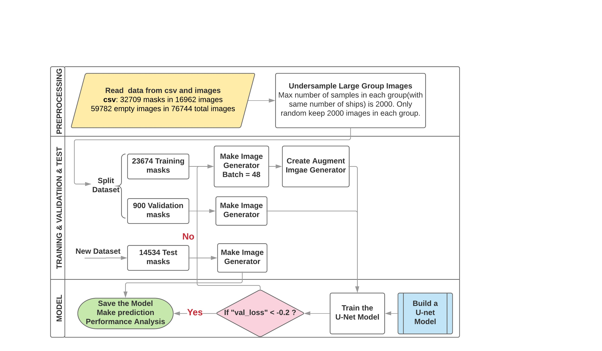

# Test task for Internship in Data Science

### Airbus Ship Detection Challenge

This is my solution Kaggle's [Airbus Ship Detection challenge](https://www.kaggle.com/c/airbus-ship-detection/code?competitionId=9988&sortBy=scoreDescending&language=Python). 

The goal of the competition is to analyze satellite images of container ships and produce segmentation masks of the ships.

In this project, I am going to locate ships in images, and show segment mask around the ships we locate. Many images do not contain ships, and those that do may contain multiple ships. Ships within and across images may differ in size (sometimes significantly) and be located in open sea, at docks, marinas, etc.

### DATA PREPROCESSING

> 🍒 Installation 🍒
> 
1️⃣Clone this repo

`git clone https://github.com/Kitty2221/Ship-Detection-Challenge.git`

2️⃣ Create virtual environment

    python -m venv venv

3️⃣Activate it (depends on the OS)

`venv\Scripts\activate`

4️⃣ Install dependencies

`pip install -r requirements.txt`

5️⃣ Load [dataset](https://www.kaggle.com/competitions/airbus-ship-detection/data)

6️⃣ Run  app locally

🦄 That's all! Enjoy! 🦄

### Results

Due to the lack of available resources, the training of the models was limited. In more details I have used just a small portion of the initial dataset. So consider using more images and further train with more epochs. This will probably improve performance as the loss functions do not converge after only 20 epochs. So this mean that there is more road to traverse. Furthermore, avoid downscaling the images as higher resolution images will lead to more precise predicted segmentation masks.

The model copes well with pictures with good contrast and where there are large obvious ships. Also when there are no shores of piers in the picture.
On the other hand, in pictures where there are a lot of small ships, the model copes poorly.